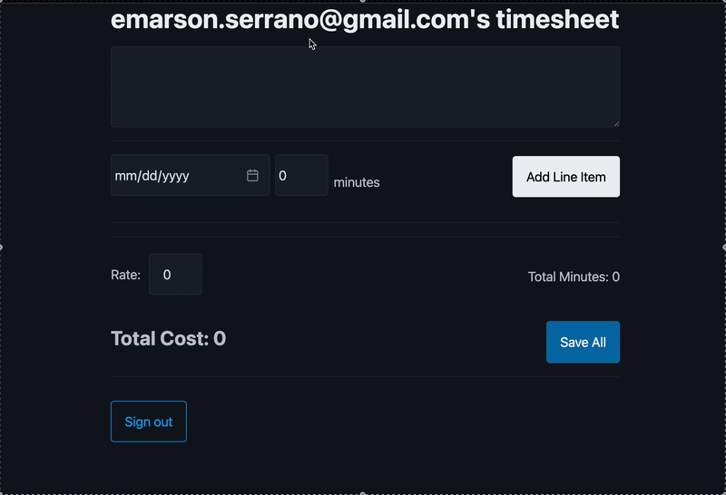

# Timesheet App


## Run locally

Follow these steps to install dependencies and run the app on your machine.

1. Install Node.js (v16+) and npm if you don't already have them.
2. Install dependencies:

```bash
npm install
```

3. Start the dev server (Vite) and open http://localhost:5173:

```bash
npm run dev
```

4. Useful commands:

```bash
# build for production
npm run build

# preview the production build
npm run preview

# run the linter
npm run lint
```

## Data model (Timesheet — LineItem)

This project uses the Amplify Data construct to define a simple many-to-one relationship:

- Timesheet (one)
	- description: string
	- rate: float
	- lineItems: hasMany(LineItem) — defined with the foreign key `timesheetId`

- LineItem (many)
	- timesheetId: id (references Timesheet.id)
	- date: date
	- minutes: float
	- timesheet: belongsTo(Timesheet, 'timesheetId')

The model is defined in `amplify/data/resource.ts` using:

```ts
Timesheet: a.model({ description: a.string(), rate: a.float(), lineItems: a.hasMany('LineItem','timesheetId') })
LineItem: a.model({ timesheetId: a.id(), date: a.date(), minutes: a.float(), timesheet: a.belongsTo('Timesheet','timesheetId') })
```

Authorization for both models uses owner-based rules (so records are scoped to the creating user):

```ts
.authorization((allow) => [allow.owner()])
```

Example usage with the generated Data client (`generateClient<Schema>()`):

```ts
// create a timesheet
const timesheetRes = await client.models.Timesheet.create({ description: 'October work', rate: 3 });
const timesheetId = timesheetRes?.data?.id ?? timesheetRes?.id;

// create a line item attached to the timesheet
await client.models.LineItem.create({ date: '2025-10-06', minutes: 60, timesheetId });

// list line items for a timesheet
const listRes = await client.models.LineItem.list({ filter: { timesheetId: { eq: timesheetId } } });
const lineItems = listRes?.data ?? listRes;

// update a line item
await client.models.LineItem.update({ id: lineItemId, minutes: 90 });

// delete a line item
await client.models.LineItem.delete({ id: lineItemId });
```

Depending on runtime and client configuration, related items may appear embedded on the Timesheet object (for example, `timesheet.lineItems`), or you can query `LineItem` by `timesheetId` as shown above.

## AWS Amplify React+Vite Starter Template

This repository provides a starter template for creating applications using React+Vite and AWS Amplify, emphasizing easy setup for authentication, API, and database capabilities.

## Overview

This template equips you with a foundational React application integrated with AWS Amplify, streamlined for scalability and performance. It is ideal for developers looking to jumpstart their project with pre-configured AWS services like Cognito, AppSync, and DynamoDB.

## Features

- **Authentication**: Setup with Amazon Cognito for secure user authentication.
- **API**: Ready-to-use GraphQL endpoint with AWS AppSync.
- **Database**: Real-time database powered by Amazon DynamoDB.

## Deploying to AWS

For detailed instructions on deploying your application, refer to the [deployment section](https://docs.amplify.aws/react/start/quickstart/#deploy-a-fullstack-app-to-aws) of our documentation.

## Security

See [CONTRIBUTING](CONTRIBUTING.md#security-issue-notifications) for more information.

## License

This library is licensed under the MIT-0 License. See the LICENSE file.

